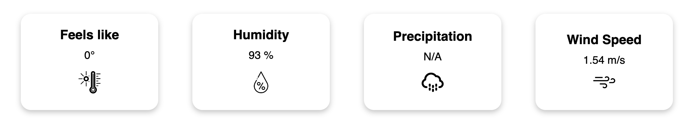
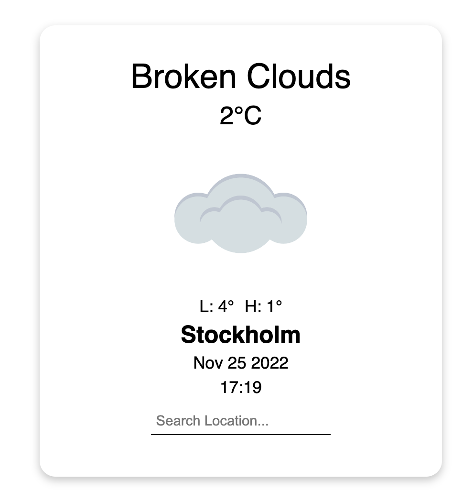
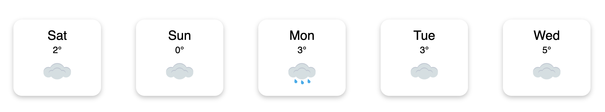

# odin-weather-app

### 4 Misc Info Data Cards

### Main Weather Card

### Five Day Forecast

## Access the page [here](https://benjamin-albarzendji.github.io/odin-weather-app/)

### Description
This is a project leveraging the OpenWeatherMap free API to enable an user to check the weather for a location of their choice. It tries to default to users own location but if that fails then it will return the weather detalis of Stockholm.   
The  weather details will include:
* Main Card with weather, high, lows, current location time and a dynamic icon that will change depending on API weather status. 
* 4 Data Cards above the main card, with information about "Feels Like", "Humidity", "Precipitation" & and "Wind Speed" 
* A five day forecast is created below the main card with dynamic icon changing depending on API weather status. 

### Thoughts: 
* Moduling of functions saves an immense amount of time. Analzying the current app, I should have made more functions to design the cards rather than independently designing each and every card via JS. It will shorten the code base, make it cleaner and scalable. 
*  It is not fully flexible (yet)

### Project Technologies:
* CSS 
* HTML
* JavaScript
* JS Await / Async & Promises
* Webpack
* OpenWeatherMap API 

